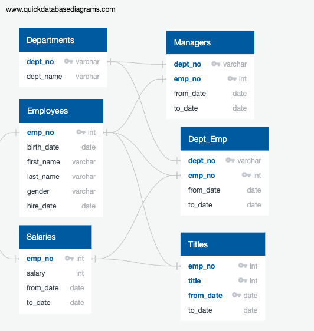

# Pewlett-Hackard-Analysis

## **Overview of the analysis**:

This purpose of this analysis is to report the statistics of current employees who reach retirement age to Bobby's manager.  The analysis includes the following steps:

- Write a query to determine the most recent title for the retirement employees;
- Count the number of retiring employees by title;
- Determine the employees who are eligible for the mentorship program.

This analysis used PostgreSQL 11, pd Admin and Visual Studio Code to create queries.

## **Results**

To determine the relationships between each tables to set primary keys, foriegn keys and data types, Entity Relationship Diagrams (ERDs) is created as below:

Based on ERD, four new tables was created for retirement employees and their titles, retirement employees with their titles when they retire, count of retirement employees by titles, and current employees who are eligible for the mentership program:

1. **Retirement Titles**

This query joint employees table and titles table on employee number (emp_no) as primary key to selecte the employees who born between the year of 1952 and 1955.  However, after this select, an employee might brings multiple results in the new table because an employee might under different titles before they retire.  To select their last title when their retire, the next table is created.

Retirement Titles table details is in Data([retirement_titles.csv](Data/retirement_titles.csv))

2. **Unique Titles**

To select the final title for the retired employees, SELECT DISTRINCT ON() clause is used to pick the most recent title.  The result were selected from retirement_titles.csv and put into the new table unique_titles.csv.

Unique Titles table details is in Data([unique_titles.csv](Data/unique_titles.csv))

3. **Retiring Titles**

This table is created to count the retiring employees by titles using COUNT().  Datas are statistic from unique_titles and group by tittle.

Retiring Titles table details is in Data([retiring_titles.csv](Data/retiring_titles.csv))

4. **Mentorship Eligibilty**

The data from employee table, dept_emp table and title table are selected to build this new query for selecting the employees who are eligible for the mentorship program.  Tables were joint on emp_no and employees were filtered by birth_data to select the employees who borned in 1965.

Mentorship Eligibilty table details is in Data([mentorship_eligibilty.csv](Data/mentorship_eligibilty.csv))

## **Summary**

- **Q**: How many roles will need to be filled as the "silver tsunami" begins to make an impact?
- **A**: 90398 roles will needed to hire new employees caused by the employees retiring.

- **Q**: Are there enough qualified, retirement-ready employees in the departments to mentor the next generation of Pewlett Hackard employees?
- **A**: No.  There is 1,549 employees who are eligible to participate in the mentorship program.

- **Q**: Provide two additional queries or tables that may provide more insight into the upcoming "silver tsunami."
- **A**: 
  * Query for current employees with the most recent titles could be created.
  * Query for current employees who are able to fill in the roles could be created

